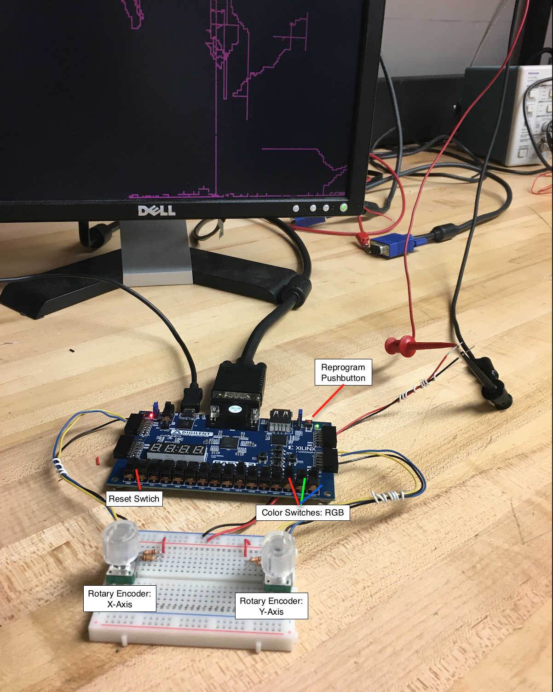

# Digital Etch-a-Sketch

A digital etch-a-sketch was created by using Visual Hardware Description Language, VHDL, on an FPGA board. The build process, functionality, high-level logic, resulting circuit schematics, and final analyses are documented.

## Getting Started

[These instructions](https://medium.com/@taggartbonham/etch-a-sketch-b1c360846848) will get you a copy of the project up and running on your local machine for development and testing purposes.

### Materials

Reference       |Qty|Part Number  |Description
--------------|:---:|:-------------:|---------------------
Basys3|1|Basys3|Digilent Basys3 board
Display|1| |640x480 LCD Display w/ VGA to FPGA Connector
R1-4|4| |10K Ω 1⁄4-watt resistor
En1-2|2|	COM-09117|	12-step Rotary encoder w/ knob
BB1|1|	BB-32621|	Sodderless Breadboard
